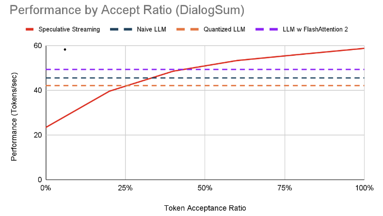

# Optimization for LLM Inference

### Goals
This project aims to compare the multiple strategies that optimizes the llm inference. The optimization techniques include 1) Naive LLM, 2) LLM with quantization (half precision), 3) Flash Attention2 and Specuative Streaming

### Components

1) datasets directory include all codes related to the dataset.

2) models include all codes for optimization techniques that mentioned above

3) As speculative streaming needs the modification in both LLM code and generation, we modified the code 
from huggingface and huggingface directory includes all modification and codes for speculative streming.

Specifically, the model code is in huggingface/transformers/models/gpt_neo and generation code is included in huggingface/transformers/generation/utils.py.

### Executing program

Please use the following command

```
python dataset_tps.py --model_type [optimization technique]
```

### Results

When running with GeForce RTX 3090, the results are as below. (tokens/sec)

|             | Spider     |       DialogSum         |   E2E-NLG|
|-------------|-----------------|----------------|-----------------|
|        Naive LLM    | 44.459 | 45.504 | 45.560 |
| LLM+half precision Quantization       | 41.660      | 42.075     | 42.360 |
| LLM+Flash Attention2 | 49.229          | 49.290          | 43.971     | 
| LLM+Speculative Streaming | **54.661**          | **56.038 **         | **54.782**    | 

The performance by acceptance ratio was as a below graph.




We can notice that LLM+Speculative Streaming was the most powerful optimization technique and unsuprisingly the performance gain is large corresponding to the high token accept ratio.

You can find more details / experiment on other GPUs on our final report.

## Version History

* 0.1
    * Initial Release (6 May 2024)